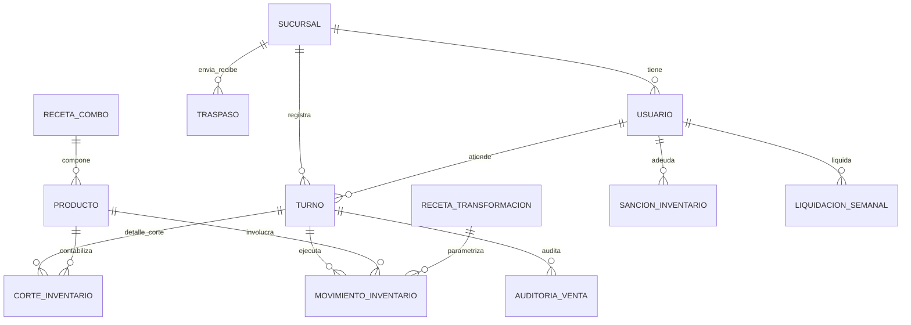

# Phase 1: Data Model Specification

**Feature**: Sistema de Inteligencia y Control de Inventario (Grupo Punto Frío) v1.2  
**Feature Branch**: `001-control-inventario-transformaciones`  
**Date**: 2026-09-05  

---

## 1. Esquema de Base de Datos Relacional (MySQL / MariaDB / PostgreSQL)

El sistema opera bajo un esquema **Multi-Tenant a nivel lógico** centralizado en una única base de datos donde cada entidad de movimiento y balance incluye `sucursal_id`.

---

## 2. Definición Detallada de Tablas y Entidades

### 2.1 `sucursales`
Representa los puntos de venta / casas del Grupo Punto Frío.
- `id`: BIGINT UNSIGNED AUTO_INCREMENT PRIMARY KEY
- `nombre`: VARCHAR(100) NOT NULL UNIQUE (ej. 'Casa22', 'Casa Coron', 'Madan')
- `codigo`: VARCHAR(20) NOT NULL UNIQUE (ej. 'C22', 'CCORON', 'MDN')
- `direccion`: VARCHAR(255) NULLABLE
- `activo`: BOOLEAN NOT NULL DEFAULT TRUE
- `created_at`, `updated_at`: TIMESTAMP

---

### 2.2 `usuarios`
Personal operativo (barmen/garzones) y administradores/auditores.
- `id`: BIGINT UNSIGNED AUTO_INCREMENT PRIMARY KEY
- `nombre`: VARCHAR(100) NOT NULL
- `apellido`: VARCHAR(100) NOT NULL
- `rol`: ENUM('barman', 'garzon', 'admin') NOT NULL DEFAULT 'barman'
- `pin_hash`: VARCHAR(255) NOT NULL (Hash seguro bcrypt/Argon2 del PIN numérico de 4 dígitos)
- `modalidad_cobro`: ENUM('diario', 'semanal') NOT NULL DEFAULT 'diario' (Diario para Turno Día / Semanal para Turno Noche)
- `sucursal_actual_id`: BIGINT UNSIGNED NULLABLE (Sucursal de rotación asignada para la semana activa)
  - *FK*: `sucursal_actual_id` REFERENCES `sucursales(id)` ON DELETE SET NULL
- `saldo_deudor_acumulado`: DECIMAL(10,2) NOT NULL DEFAULT 0.00 (Monto en Bs adeudado por sanciones de faltantes)
- `activo`: BOOLEAN NOT NULL DEFAULT TRUE
- `created_at`, `updated_at`: TIMESTAMP

---

### 2.3 `productos`
Catálogo de insumos (materia prima) y productos terminados.
- `id`: BIGINT UNSIGNED AUTO_INCREMENT PRIMARY KEY
- `nombre`: VARCHAR(150) NOT NULL (ej. 'Cerveza en Lata', 'Corona en Botella', 'Ron Bacardi Blanco')
- `codigo_barra`: VARCHAR(50) NULLABLE
- `tipo`: ENUM('insumo', 'terminado', 'ambos') NOT NULL
- `unidad_medida`: ENUM('unidad', 'fraccion_cuartos') NOT NULL DEFAULT 'unidad'
- `es_transformable`: BOOLEAN NOT NULL DEFAULT FALSE
- `activo`: BOOLEAN NOT NULL DEFAULT TRUE
- `created_at`, `updated_at`: TIMESTAMP

---

### 2.4 `recetas_transformacion`
Reglas dinámicas de conversión de insumos a productos terminados y liquidación de comisiones.
- `id`: BIGINT UNSIGNED AUTO_INCREMENT PRIMARY KEY
- `insumo_origen_id`: BIGINT UNSIGNED NOT NULL
  - *FK*: `insumo_origen_id` REFERENCES `productos(id)`
- `producto_destino_id`: BIGINT UNSIGNED NOT NULL
  - *FK*: `producto_destino_id` REFERENCES `productos(id)`
- `tarifa_comision_unidad`: DECIMAL(8,2) NOT NULL DEFAULT 1.00 (Importe en Bs a pagar por cada unidad neta producida)
- `ratio_referencia_esperado`: DECIMAL(6,3) NOT NULL DEFAULT 1.000 (ej. 1.100 latas por botella)
- `umbral_desviacion_alerta`: DECIMAL(5,2) NOT NULL DEFAULT 15.00 (Porcentaje de tolerancia antes de alerta)
- `activo`: BOOLEAN NOT NULL DEFAULT TRUE
- `created_at`, `updated_at`: TIMESTAMP

---

### 2.5 `recetas_combos`
Tabla de equivalencia para el desglose automático de combos vendidos en caja.
- `id`: BIGINT UNSIGNED AUTO_INCREMENT PRIMARY KEY
- `nombre_combo`: VARCHAR(150) NOT NULL (ej. 'Balde 6 Coronas', 'Combo 4 Cervezas')
- `producto_terminado_id`: BIGINT UNSIGNED NOT NULL
  - *FK*: `producto_terminado_id` REFERENCES `productos(id)`
- `unidades_equivalentes`: INT UNSIGNED NOT NULL (ej. 6 para balde de 6)
- `activo`: BOOLEAN NOT NULL DEFAULT TRUE
- `created_at`, `updated_at`: TIMESTAMP

---

### 2.6 `turnos`
Jornada de 12 horas asignada a un barman en una sucursal específica.
- `id`: BIGINT UNSIGNED AUTO_INCREMENT PRIMARY KEY
- `sucursal_id`: BIGINT UNSIGNED NOT NULL
  - *FK*: `sucursal_id` REFERENCES `sucursales(id)`
- `barman_id`: BIGINT UNSIGNED NOT NULL
  - *FK*: `barman_id` REFERENCES `usuarios(id)`
- `tipo_turno`: ENUM('dia', 'noche') NOT NULL
- `estado`: ENUM('abierto', 'cobrado', 'cerrado', 'auditado') NOT NULL DEFAULT 'abierto'
- `fecha_apertura`: DATETIME NOT NULL
- `fecha_cierre`: DATETIME NULLABLE
- `total_transformaciones_netas`: INT NOT NULL DEFAULT 0
- `total_comision_bruta`: DECIMAL(10,2) NOT NULL DEFAULT 0.00
- `total_sancion_descontada`: DECIMAL(10,2) NOT NULL DEFAULT 0.00
- `total_comision_neta_pagada`: DECIMAL(10,2) NOT NULL DEFAULT 0.00
- `codigo_recibo_cobro`: VARCHAR(20) NULLABLE UNIQUE (Código alfanumérico único para la pantalla a cajera)
- `foto_comprobante_cobro`: VARCHAR(255) NULLABLE (Ruta de la fotografía obligatoria del dinero en efectivo o comprobante de transferencia bancaria capturada al cobrar)
- `fecha_cobro`: DATETIME NULLABLE
- `created_at`, `updated_at`: TIMESTAMP

---

### 2.7 `cortes_inventario`
Registros físicos de apertura y cierre de turno con conteo exacto de unidades y cuartos de botella.
- `id`: BIGINT UNSIGNED AUTO_INCREMENT PRIMARY KEY
- `turno_id`: BIGINT UNSIGNED NOT NULL
  - *FK*: `turno_id` REFERENCES `turnos(id)` ON DELETE CASCADE
- `producto_id`: BIGINT UNSIGNED NOT NULL
  - *FK*: `producto_id` REFERENCES `productos(id)`
- `tipo_corte`: ENUM('inicial', 'final') NOT NULL
- `cantidad`: DECIMAL(8,2) NOT NULL (Soporta fracciones exactas: 0.25, 0.50, 0.75, 1.00...)
- `created_at`: TIMESTAMP

---

### 2.8 `movimientos_inventario` (Core Transaccional)
Bitácora inmutable de todo flujo de material en la barra.
- `id`: BIGINT UNSIGNED AUTO_INCREMENT PRIMARY KEY
- `uuid_local`: VARCHAR(36) NOT NULL UNIQUE (Identificador idempotente generado por la app Flutter)
- `turno_id`: BIGINT UNSIGNED NOT NULL
  - *FK*: `turno_id` REFERENCES `turnos(id)`
- `sucursal_id`: BIGINT UNSIGNED NOT NULL
  - *FK*: `sucursal_id` REFERENCES `sucursales(id)`
- `producto_id`: BIGINT UNSIGNED NOT NULL
  - *FK*: `producto_id` REFERENCES `productos(id)`
- `tipo_movimiento`: ENUM('ingreso', 'transformacion_consumo', 'transformacion_produccion', 'baja_rotura', 'traspaso_salida', 'traspaso_entrada', 'merma_transito') NOT NULL
- `cantidad`: DECIMAL(8,2) NOT NULL
- `foto_path`: VARCHAR(255) NULLABLE (Obligatorio en 'ingreso' y opcional en 'baja_rotura')
- `receta_id`: BIGINT UNSIGNED NULLABLE
  - *FK*: `receta_id` REFERENCES `recetas_transformacion(id)`
- `ratio_calculado`: DECIMAL(6,3) NULLABLE
- `observaciones`: TEXT NULLABLE
- `fecha_movimiento`: DATETIME NOT NULL
- `created_at`, `updated_at`: TIMESTAMP

---

### 2.9 `traspasos` y `traspasos_detalles`
Circuito de custodia inter-sucursales multi-producto.
- **Cabecera `traspasos`**:
  - `id`: BIGINT UNSIGNED AUTO_INCREMENT PRIMARY KEY
  - `sucursal_origen_id`: BIGINT UNSIGNED NOT NULL
    - *FK*: `sucursal_origen_id` REFERENCES `sucursales(id)`
  - `sucursal_destino_id`: BIGINT UNSIGNED NOT NULL
    - *FK*: `sucursal_destino_id` REFERENCES `sucursales(id)`
  - `estado`: ENUM('en_transito', 'recibido_conforme', 'recibido_con_discrepancia', 'cancelado') NOT NULL DEFAULT 'en_transito'
  - `usuario_emisor_id`: BIGINT UNSIGNED NOT NULL
    - *FK*: `usuario_emisor_id` REFERENCES `usuarios(id)`
  - `usuario_receptor_id`: BIGINT UNSIGNED NULLABLE
    - *FK*: `usuario_receptor_id` REFERENCES `usuarios(id)`
  - `foto_despacho`: VARCHAR(255) NULLABLE
  - `foto_recepcion`: VARCHAR(255) NULLABLE
  - `observaciones`: TEXT NULLABLE
  - `fecha_envio`: DATETIME NOT NULL
  - `fecha_recepcion`: DATETIME NULLABLE
  - `created_at`, `updated_at`: TIMESTAMP

- **Detalle `traspasos_detalles`**:
  - `id`: BIGINT UNSIGNED AUTO_INCREMENT PRIMARY KEY
  - `traspaso_id`: BIGINT UNSIGNED NOT NULL
    - *FK*: `traspaso_id` REFERENCES `traspasos(id)` ON DELETE CASCADE
  - `producto_id`: BIGINT UNSIGNED NOT NULL
    - *FK*: `producto_id` REFERENCES `productos(id)`
  - `cantidad_despachada`: DECIMAL(8,2) NOT NULL
  - `cantidad_recibida_conforme`: DECIMAL(8,2) NOT NULL DEFAULT 0.00
  - `cantidad_merma_transito`: DECIMAL(8,2) NOT NULL DEFAULT 0.00
  - `created_at`, `updated_at`: TIMESTAMP

---

### 2.10 `auditorias_ventas`
Cruce diario entre el balance de inventario y las ventas del Ticket Z.
- `id`: BIGINT UNSIGNED AUTO_INCREMENT PRIMARY KEY
- `turno_id`: BIGINT UNSIGNED NOT NULL UNIQUE
  - *FK*: `turno_id` REFERENCES `turnos(id)`
- `admin_id`: BIGINT UNSIGNED NOT NULL
  - *FK*: `admin_id` REFERENCES `usuarios(id)`
- `producto_id`: BIGINT UNSIGNED NOT NULL
  - *FK*: `producto_id` REFERENCES `productos(id)`
- `stock_inicial`: DECIMAL(8,2) NOT NULL
- `ingresos`: DECIMAL(8,2) NOT NULL DEFAULT 0.00
- `traspasos_netos`: DECIMAL(8,2) NOT NULL DEFAULT 0.00
- `materia_prima_usada`: DECIMAL(8,2) NOT NULL DEFAULT 0.00
- `producto_terminado`: DECIMAL(8,2) NOT NULL DEFAULT 0.00
- `bajas`: DECIMAL(8,2) NOT NULL DEFAULT 0.00
- `stock_final`: DECIMAL(8,2) NOT NULL
- `consumo_fisico_calculado`: DECIMAL(8,2) NOT NULL
- `ventas_ticket_z`: DECIMAL(8,2) NOT NULL (Ventas individuales + Desglose de combos)
- `diferencia`: DECIMAL(8,2) NOT NULL (`Consumo Físico - Ventas`)
- `resultado`: ENUM('cuadrado', 'faltante', 'sobrante') NOT NULL
- `sancion_monto`: DECIMAL(10,2) NOT NULL DEFAULT 0.00
- `observaciones`: TEXT NULLABLE
- `fecha_auditoria`: DATETIME NOT NULL
- `created_at`, `updated_at`: TIMESTAMP

---

### 2.11 `sanciones_inventario`
Deudas económicas asignadas al empleado por faltantes detectados.
- `id`: BIGINT UNSIGNED AUTO_INCREMENT PRIMARY KEY
- `usuario_id`: BIGINT UNSIGNED NOT NULL
  - *FK*: `usuario_id` REFERENCES `usuarios(id)`
- `auditoria_id`: BIGINT UNSIGNED NOT NULL
  - *FK*: `auditoria_id` REFERENCES `auditorias_ventas(id)`
- `monto_sancion`: DECIMAL(10,2) NOT NULL
- `monto_descontado`: DECIMAL(10,2) NOT NULL DEFAULT 0.00
- `estado`: ENUM('pendiente', 'descontado_caja', 'descontado_semanal', 'anulado') NOT NULL DEFAULT 'pendiente'
- `fecha_imputacion`: DATETIME NOT NULL
- `fecha_liquidacion`: DATETIME NULLABLE
- `created_at`, `updated_at`: TIMESTAMP

---

### 2.12 `liquidaciones_semanales`
Resumen de pago para barmen de Turno Noche.
- `id`: BIGINT UNSIGNED AUTO_INCREMENT PRIMARY KEY
- `usuario_id`: BIGINT UNSIGNED NOT NULL
  - *FK*: `usuario_id` REFERENCES `usuarios(id)`
- `semana_ano`: VARCHAR(10) NOT NULL (ej. '2026-W36')
- `fecha_inicio`: DATE NOT NULL
- `fecha_fin`: DATE NOT NULL
- `total_turnos`: INT NOT NULL
- `total_comisiones_brutas`: DECIMAL(10,2) NOT NULL
- `total_sanciones_deducidas`: DECIMAL(10,2) NOT NULL
- `total_neto_a_pagar`: DECIMAL(10,2) NOT NULL
- `estado`: ENUM('borrador', 'aprobado', 'pagado') NOT NULL DEFAULT 'borrador'
- `created_at`, `updated_at`: TIMESTAMP

---

### 2.13 `compras` y `compras_detalles` (Ingreso de Mercadería Multi-Producto)
Registro de facturas y notas de compra de proveedores conteniendo múltiples productos.
- **Cabecera `compras`**:
  - `id`: BIGINT UNSIGNED AUTO_INCREMENT PRIMARY KEY
  - `sucursal_id`: BIGINT UNSIGNED NOT NULL
    - *FK*: `sucursal_id` REFERENCES `sucursales(id)`
  - `usuario_id`: BIGINT UNSIGNED NOT NULL (Quien recibe y registra el abastecimiento)
    - *FK*: `usuario_id` REFERENCES `usuarios(id)`
  - `proveedor`: VARCHAR(150) NOT NULL (ej. 'Cervecería Boliviana Nacional', 'Distribuidora Central')
  - `numero_nota_factura`: VARCHAR(50) NULLABLE
  - `foto_comprobante`: VARCHAR(255) NOT NULL (Ruta de la fotografía obligatoria de la factura o remisión)
  - `total_costo_estimado`: DECIMAL(10,2) NOT NULL DEFAULT 0.00
  - `observaciones`: TEXT NULLABLE
  - `fecha_compra`: DATETIME NOT NULL
  - `created_at`, `updated_at`: TIMESTAMP

- **Detalle `compras_detalles`**:
  - `id`: BIGINT UNSIGNED AUTO_INCREMENT PRIMARY KEY
  - `compra_id`: BIGINT UNSIGNED NOT NULL
    - *FK*: `compra_id` REFERENCES `compras(id)` ON DELETE CASCADE
  - `producto_id`: BIGINT UNSIGNED NOT NULL
    - *FK*: `producto_id` REFERENCES `productos(id)`
  - `cantidad`: DECIMAL(8,2) NOT NULL
  - `costo_unitario`: DECIMAL(10,2) NOT NULL DEFAULT 0.00
  - `created_at`, `updated_at`: TIMESTAMP
